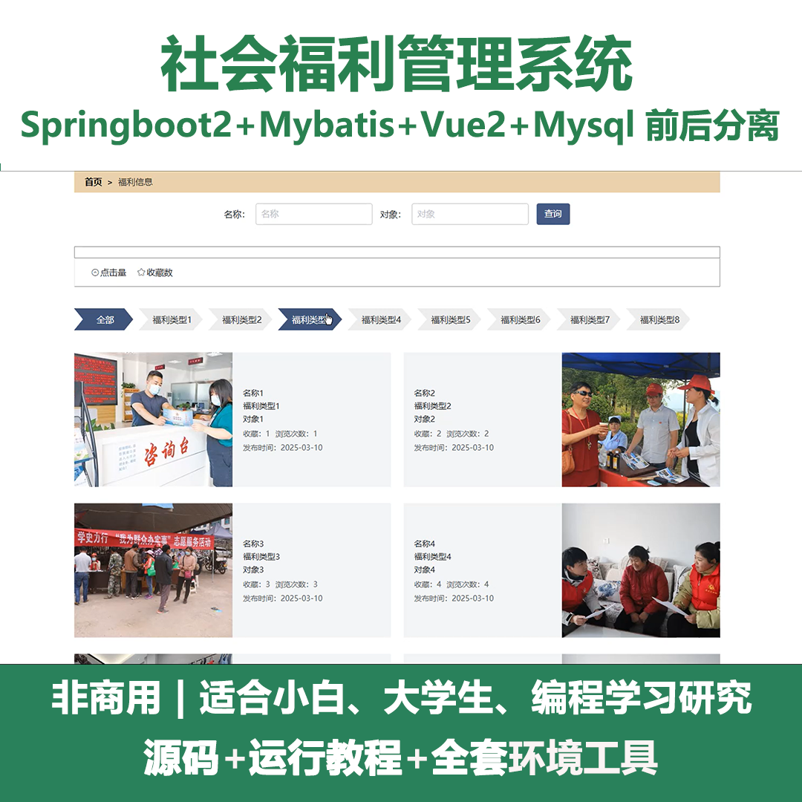
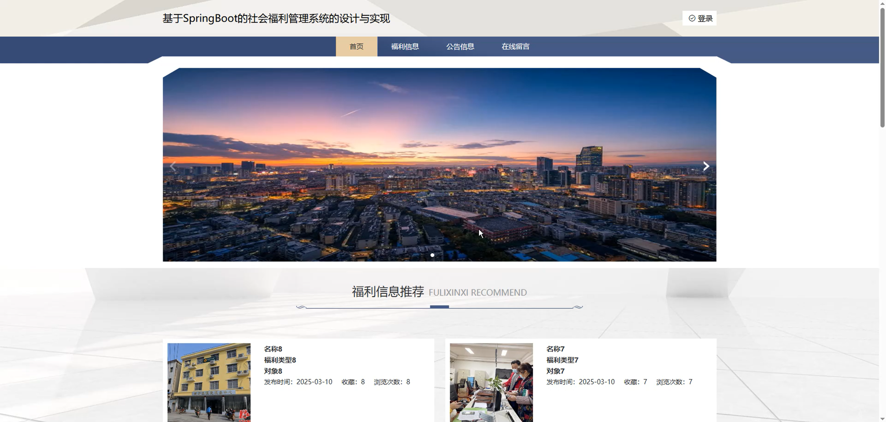
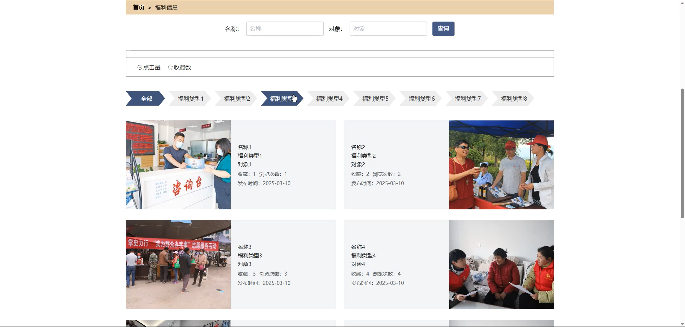
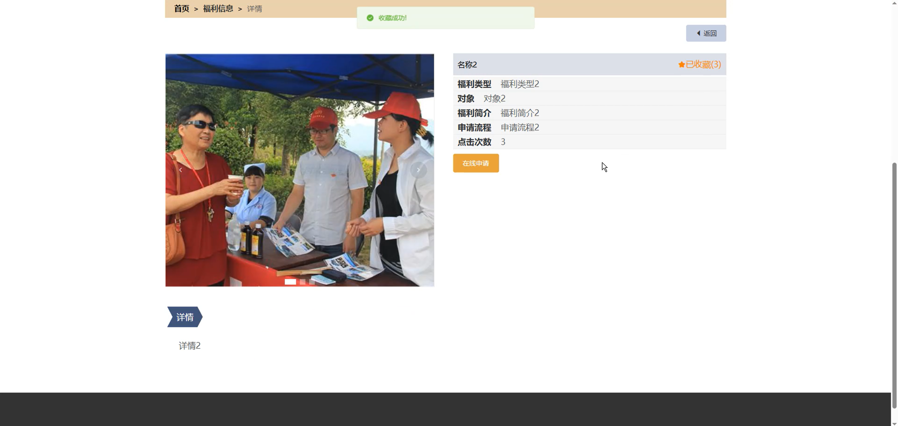
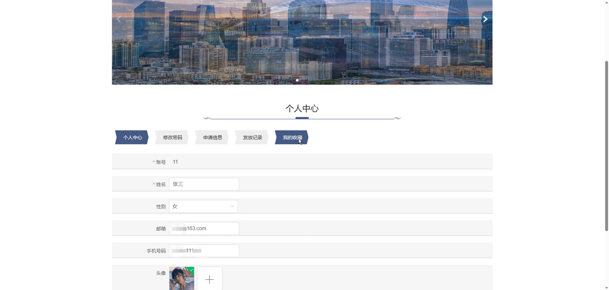
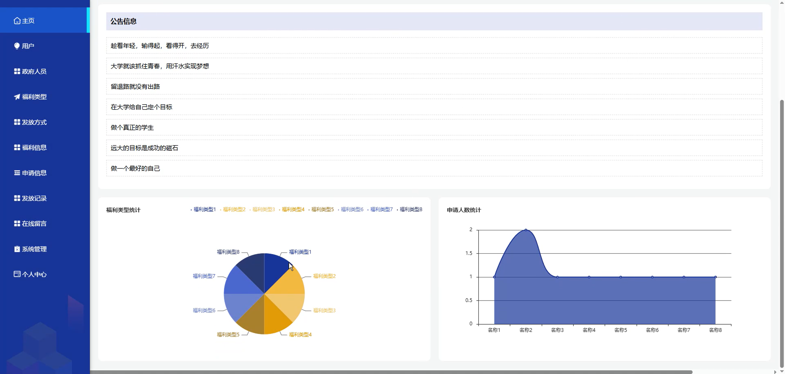
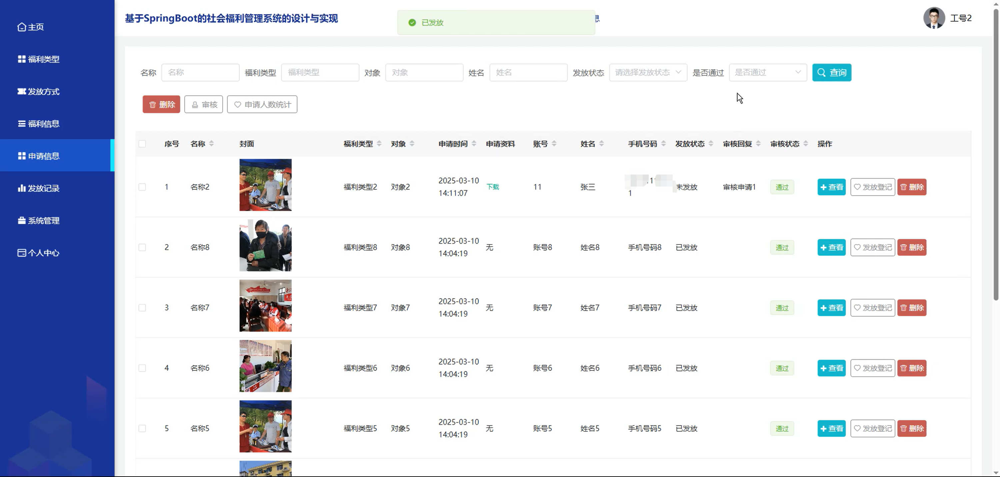
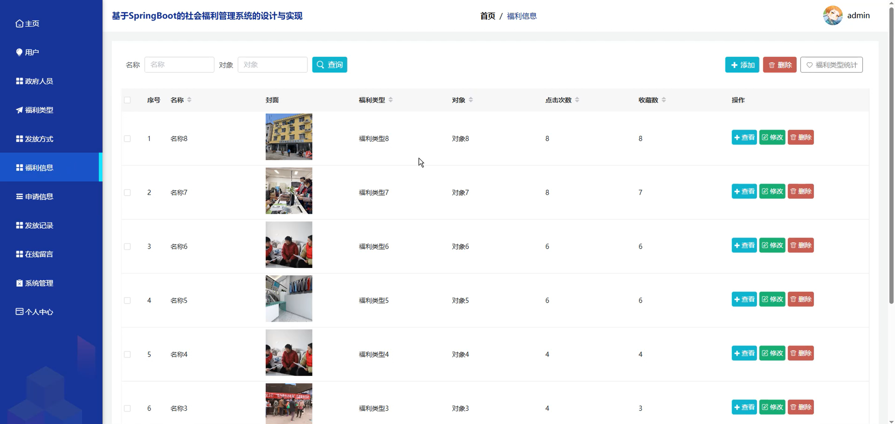
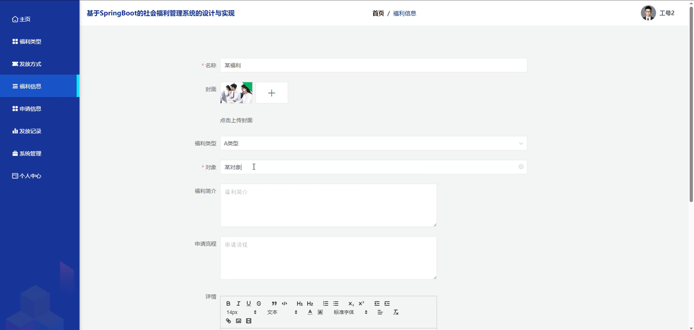

# springbootA432D
springbootA432D社会福利管理系统
 
## 查看主页获取源码

### 一、关键词
福利信息、福利申请信息、福利发放记录

### 二、作品包含
源码+数据库+全套环境和工具资源+本地部署教程

### 三、项目技术
前端技术：Html、Css、Js、Vue2.0、Element-ui 
后端技术：Java、SpringBoot2.0、MyBatis

### 四、运行环境（以下版本亲测，其他版本未知，请自测）
开发工具：IDEA/eclipse  + VSCODE

数据库：MySQL5.7（最低要5.7版本）

数据库管理工具：Navicat10以上版本

环境配置软件： JDK1.8 + Maven3.6.3

前端Nodejs：14

浏览器：谷歌浏览器

### 五、项目介绍
项目编号：springbootA432D

社会福利管理系统主要用于整合福利类型，助力高效规范开展社会福利管理工作。

角色：管理员、用户、政府人员

管理员：主页、用户、政府人员、福利类型、发放方式、福利信息、申请信息、发放记录、在线留言、系统管理、个人中心。

用户：首页、福利信息、公告信息、在线留言、个人中心、修改密码、申请信息、发放记录、我的收藏。

政府人员：主页、福利类型、发放方式、福利信息、申请信息、发放记录、系统管理、个人中心。

### 六、运行截图

